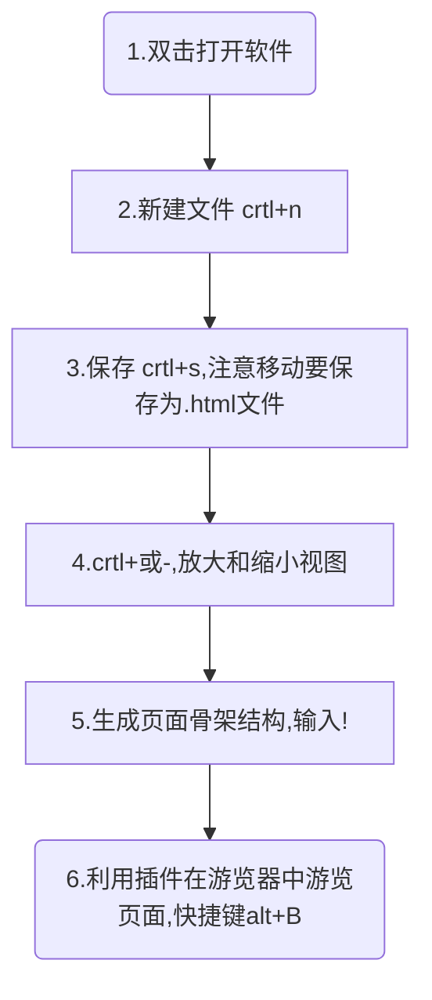

#                       HTML语法规范

vscode全屏：F11

现所学的html标签为：html5。

**html的描述**:超文本标记语言，里面包含各种各样的标签组成。

## 1.1基本语法概述

1.HTML标签是由==尖括号包围的关键词==，例如**==<html>==**

2.HTML标签==通常是成对出现的==，例如<html>和</html>,我们称为==双标签==。<html>:开始标签，</html>:结束标签

3.特殊的标签：如单个标签（极少情况），例如==**<br />**==--------英文＋空格＋/ ,我们称为==单标签==。

## 1.2标签关系

双标签关系分为两类：<u>包含关系</u>和<u>并列关系</u>

```html
                    ==包含关系==
<head>
    <title>  </title>
</head>

head是title的父亲，title是head的儿子
```

```html
                    ==并列关系==
<head></head>
<body></body>

head和body是兄弟关系
```

```html
例：
   <html>
      <head></head>
       <body></body>
</html>

html是head和body的父亲，head和body是兄弟，共同双亲是html
```

#                HTML基本结构标签

## 2.1第一个HTML网页

​    每个网页都会有一个基本的<u>结构标签（也称为骨架标签）</u>，页面内容也是在这些基本标签上书写.

   HTML页面也称为HTML文档

| 标签名          | 定义       | 说明                                                       |
| --------------- | ---------- | ---------------------------------------------------------- |
| <html></html>   | HTML标签   | 页面中最大的标签，称为==根标签==                           |
| <head></head>   | 文档的头部 | 注意在head标签中我们必须要设置的标签是title                |
| <title></title> | 文档的标题 | 让页面拥有一个属于自己的网页标题                           |
| <body></body>   | 文档的主体 | 元素包含文档的所有文档内容，页面内容基本都是放到body里面的 |

HTML文档的后缀名必须是==.html==或==.htm==，游览器的作用是读取HTML文档，并以网页的形式显示出它们。

```html
           ===第一个html网页（骨架标签）===
<html>
    <head>
        <title>我的第一个网页</title>
    </head>
    <body>
      前端学习之路第一步  
    </body>
</html>
```

 页面展示：.png)

## 2.2基本结构标签总结

如图所示：

 #                  网页开发工具

1.主流前端工具：visuol studio code                   webstorm

## 3.1vscode使用

第一步：进入vscode，文件-----新建文本文件或(ctrl＋n),之后一定要记得==保存==文件，快捷键为crtl+s。文件名的后缀名应为==**.html**==,这就创建了一个.html的文件.

注：<u>==每一个.html文件它都有一个骨架标签。==</u>

***


### 结构标签（骨架标签）如何展示：

#<u>**==(重要的)==**以**==！==**号显示-----**HTML骨架标签的快速创建**</u>

### vscode骨架标签的操作如图所示：


***


### 3.2==通过vscode的骨架标签写出一个网页

需要插件：<u>open in browser</u>

代码如图所示：

```html
<!DOCTYPE html>
<html lang="en">
<head>
    <meta charset="UTF-8">
    <meta http-equiv="X-UA-Compatible" content="IE=edge">
    <meta name="viewport" content="width=device-width, initial-scale=1.0">
    <title>我利用vscode创建的第一个页面</title>
</head>
<body>
    写代码是一件非常快乐的事情
</body>
</html>


```

>**title中间是可修改的网页标题     body中间是可修改的页面内的文本描述**

建立起网页：快捷键==AIT＋B==

页面的代码放大或放小:==crtl+==,==crtl-==




# 3.3vscode插件使用

**下载插件流程**:vscode左侧往下第四个图标，进行相关搜索。==安装完成后一定要重启软件==

**插件**:

| 插件                                 | 作用                         |
| ------------------------------------ | ---------------------------- |
| Chinese(simplified) pack for vx code | 中文（简体）语言包           |
| open in Browser                      | 右击选择游览器打开html       |
| Auto Rename Tag                      | 自动重命名配对的HTML/XML标签 |
| css Peek                             | 追踪至样式                   |

 **open in Browser 用法**：快捷键Alt+B（预览html），shift+Alt+B(选择你想选择的游览器来打开这个html文件)

# 3.4DOCTYPE和lang以及字符集的作用


## vscode工具生成骨架标签新增代码

1.<!DOCTYPE>标签

2.lang语言

3.charset字符集


## 文档类型声明标签

<!DOCTYPE>文档类型声明，作用就是告诉游览器使用哪种HTML版本来显示网页

</!doctype>

```html
<!DOCTYPE html>  ---------文档内型声明标签
```

这句代码的意思是：当前页面采取的是HTML5版本来显示网页.

**注意**:1.<!DOCTYPE>声明位于文档中的最前面的位置，<u>==处于<html>标签之前==</u>

2.<!DOCTYPE>不是一个<u>HTML</u><u>标签</u>，它就是==文档类型声明标签==

## lang语言种类

用来定义当前文档显示的语言

1.en定义语言为英语

2.zh-CN定义语言为中文（一般是用这个定义中文网站）

简单来说定义为en就是英文网页，定义为zh-CN就是中文网页    **注**:对文档显示来说定义en（可显示中文），定义zh-CN（可以显示英文）

## 字符集

字符集（Character set）是多个字符的集合，以便计算机能够识别和存储各种文字

在==<head>==标签内，可以通过==<meta>==标签的==charset==属性来规定HTML文档应该使用哪种字符编码。

```html
<meta charset="UTF-8">
```

charset常用的值有：GB2312,BIG5,GBK和UTF-8,其中UTF-8也被称为万国码，基本包含了全世界所有国家需要用的字符。


**注**：上面语法为必写的代码，不然会乱码，一定要标准写=="UTF-8"==

***

总结：以上的三个代码vscode自动生成不需要写，只要知道意思就行。

```html
1.<!DOCTYPE html>文档类型声明标签，告诉浏览器这个页面采取<u>html5</u>版本来显示页面
2.<html lang="en">告诉浏览器这是一个英文网站，本页面采取英文来显示
3.<meta charset="UTF-8">必须写，采取UTF-8来保存文字，如果不写会乱码  
    补：<meta http-equiv="X-UA-Compatible" content="IE=edge">
    <meta name="viewport" content="width=device-width, initial-scale=1.0">
```

***

#               HTML常用的标签

## 4.1标签语义

标签语义：即标签的含义

<u>根据标签的语义在合理的地方写入可以使页面结构看起来更加清晰</u>

如图：

***

## 4.2标题标签 <h1> ------<h6>(重要)

为了使网页更具有<u>语义化</u>，我们通常会在页面中使用标题标签，HTML提供了6个等级的网页标题。即==<h1>------<h6>==。


```html
<h1>我是一级标题</h1>
单词head的缩写，意为头部，标题。
==标签语义==：作为标题使用，并且依据重要性递减。
```

***特点***:1.加了标题的文字会变粗，字号也会依次变大。

2.一个标题独<u>占一行</u>。

==***口令***==：

标题一共六级选

文字加粗一行显（只在独自一行显示）

由大到小依次减

从重到轻随之变

***

## 4.3段落和换行标签（重要）

==<p>==:段落标签

在网页中，要把文字有条理显示出来，就需要将这些文字分段显示，在HTML标签中，==<p>==标签用于==定义段落==，它可以将整个网页分文若干个段落。

```html
<p>我是一个段落标签</p>
==标签语义==：可以把HTML文档分为若干个段落
```

==========（vscode）自动换行：==**Alt+Z**==  ------------------在<body>中的文字使用

***特点***:1.文本在一个段落中会根据浏览器窗口的大小自动换行

2.段落和段落之间保有空隙

```html
例：
<body>
    <p>2022年9月27日</p>
    <p>9点26分</p>
</body>
```


==<br />==                 :换行标签

```html
<br />
单词break的缩写，意为打断，换行
==标签语义==：强制换行
```

***特点***：1.<br />是个单标签

2.<br />标签只是简单的开始新的一行，跟段落不一样，段落之间会插入一些垂直的间距。

```html
例：
<body>
    2022年<br />9月27日
</body>
```

***

## 课堂案例：体育新闻案例


***

## 4.4文本格式化标签

在网页中，有时需要为文字设置==粗体==，==斜体==，或==下划线==等效果，这就需要用到HTML中的<u>**文本格式化标签**</u>，使文字以特殊的方式显示。

标签语义：突出重要性，比普通文字更重要。

| 语义   | 标签                       | 说明                       |
| ------ | -------------------------- | -------------------------- |
| 加粗   | <strong></strong>或<b></b> | 更推荐<strong>，语义更强烈 |
| 倾斜   | <em></em>或<i></i>         | 更推荐<em>，语义更强烈     |
| 删除   | <del></del>或<s></s>       | 更推荐<del>，语义更强烈    |
| 下划线 | <ins></ins>或<u></u>       | 更推荐<ins>，语义更强烈    |

重点记住<strong>和<em>

***

## 4.5<div>和<span>标签

==<div>==和==<span>==是没有语义的，它们就是一个<u>盒子</u>，用来装内容的。

```html
<div>这是头部</div>
<span>今日价格</span>
```

div是divsion的缩写，表示分隔，分区，span意为跨度，跨距。

==**特点**==

1.<div>标签用来<u>布局</u>，但是现在一行只能放一个<div>,==<u>大盒子</u>==         (div只能独占一行，是一个大盒子，一行里只有一个div)

2.<span>标签用来布局，一行上可以放多个<span>。<u>==小盒子==</u>             (span在一行上可以有多个，是一个小盒子)

***


## 4.6图像标签和路径（重点）

**1.图像标签**（与换行标签一样是一个==<u>单标签</u>==）

**在HTML标签中，标签用于定义HTML页面中的图像

```html
**
```

单词image的缩写，意为图像。

**==src==是====标签的必须属性，它用于<u>指定图像文件的路径和文件名</u>。

所谓属性，简单来说就是这个图像标签的特性。


*****==（重要操作）==**在网页中插入图片：用图像标签，==<u>所选的图片必须在html文件夹里面</u>==,之后用标签。

| 属性   | 属性值   | 说明                                 |
| :----- | -------- | ------------------------------------ |
| src    | 图片路径 | 必须属性                             |
| alt    | 文本     | 替换文本，图像不能显示的文字         |
| title  | 文本     | 提示文本，鼠标放到图像上，显示的文字 |
| width  | 像素     | 设置图像的宽度                       |
| height | 像素     | 设置图像的高度                       |
| border | 像素     | 设置图像的边框粗细                   |

```html
src使用：
       图像标签的使用<br />  //这里用标题标签写也可以
        //引号里的必须为正确的==图片文件名== ，为jpg格式
```

``` 
alt使用：
      alt 当图片显示不出来的时候我们用alt替换
      //风景照1.jpg这里是错误的图片文件名（这里可以用alt显示），之后==敲空格==   alt="我是前端小菜鸡"
```

```html
title使用:
       title提示文本 鼠标放到图片上所提示的文字
          //中间有空格
```

```html
width使用：
       width 设置图像宽度
           //中间有空格
```

```html
height使用：
      height 设置图像高度
          //中间有空格
```

==注==:如果width和height同时使用，可能会导致图片的**失真**。

```html
border使用：
     border设置图像的边框度
        //中间有空格
```

### 图像标签属性注意点

*1*:图像标签可以拥有<u>多个属性</u>，必须写在<u>标签名</u>的后面

```html
如： //src和alt属性分别写在img后面
```

*2*:属性之间不分先后顺序，标签名与属性，属性与属性之间均以空格分开

```html
如： //alt和src不分先后
```

*3*:属性采取键值对的格式，即kry= “valuse”的格式，属性=“属性值”

```html
如： //如alt=“500”
```

## 4.7目录文件夹和根目录 

**1** .

*1.1*目录文件夹和根目录

实际工作中，我们的文件不能随便乱放，否则用起来很难快速的找到他们，因此我们需要一个文件夹来管理他们。

<u>理解</u>：

==目录文件夹==:就是普通文件夹，里面只不过存放了我们做页面所需要的相关素材，比如html文件，图片等。（例如：桌面上的web-project）注：如果以后需要做一个网站，可以建一个目录文件夹，然后把东西都放进去。

==根目录==:就是目录文件夹打开后表面的那一层就是根目录，由多个html文件和图片等组成。

**2**.

*2.2*vscode打开目录文件夹

vscode------文件-----打开文件夹-------选择文件夹

**<u>在左边可以快速的创建一个新的html文件，也可以删除一个html文件。</u>

==快速打开一个目录文件夹==：桌面上找到目录文件夹后拖入vscode中。 

## 4.8路径

页面中的图片会非常多，通常我们会新建一个文件夹来存放这些图像文件，这时再查找图像，就需要采用“路径”的方式来指定图像文件的位置.

路径可以分为：

1.相对路径

2.绝对路径

***


​                             ==相对路径==:<u>图片相对于HTML页面的位置</u>(自己理解)

| 相对路径分类 | 符号 | 说明                                                         |
| ------------ | ---- | ------------------------------------------------------------ |
| 同一级路径   |      | 图像文件位于HTML文件同一级，如       |
| 下一级路径   | /    | 图像文件位于HTML文件下一级，如              注：picture这里是新建的目录文件夹名，/为下一级路径所要的符号，图片的名字。 |
| 上一级路径   | ../  | 图像文件位于HTML文件上一级，如    |

例子：==同一级路径：


如图所示：同一级路径.html和img.jpg，它们在==同一路径==

==下一级路径（<u>当html页面的图片太多时可以创建一个新的目录文件夹，之后把全部图片给它放进去这个文件夹里</u>）


==当路径html要用到picture里的图片时，我们就需要用下一级路径==

```html

```


====上一级路径==：


==当我们所创建目录文件夹html里的test.html要用到外面的风景照.jpg.时需要用上一级路径。==

```html

```

注：如果html目录文件夹里还有一个或多个文件夹时就  （../目录文件夹../目录文件夹就行）


（不太需要看）相对路径是从代码所在的这个文件出发，去寻找目标文件的，而我们这里所说的上一级，下一级和同一级就是<u>图片相对于HTML页面的位置</u>。


***

​                                          ====绝对路径==：是指目录下的绝对位置，直接到达目标位置，通常是指从盘符开始的路径。（简单来说：==<u>就是图片在你电脑上的哪个位置</u>==）

例如：“D\web\img\logo.gif"     或   完整的网络地址“http：//www.itcast.cn/images/logo.gif”


==画红线的就为绝对路径==


**1.	`**这个是用本地电脑的图片（了解）

```html
  //注：绝对路径后还要加个\图片名字          
```

==绝对路径和相对路径不同点==：一个是\，一个是/。

**2.**这个是用网络上的图片（如果网络上这个地址改变了那就找不到了）-+

```html
   //注：1.怎么知道网络上图片的地址：打开某个网页然后光标放在该图片上==右键复制图片地址放入==“ ”中  2.这里的地址又称为绝对路径或绝对地址
```

## 4.8超链接标签（重点）

在HTML标签中，==<a>==标签用于定义超链接，作用是从一个页面链接到另一个页面。

 1.链接的语法的格式

2.链接的分类

### 链接的语法格式

```html
<a href="跳转目标" target="目标窗口的弹出方式">文本或图像</a>
```

| 属性   | 作用                                                         |
| ------ | ------------------------------------------------------------ |
| href   | 用于指定链接目标的<u>url</u>地址，==（必须属性）==当为标签用href属性时，它就具有了超链接的功能。 |
| target | 用于指定链接页面的打开方式，其中==_self==为默认值， ==_blank==为在新窗口中打开方式。 |

### 链接的分类

1.==外部链接==（就是<u>外部的网站</u>）

例：

```html
<a href="http://www.qq.com">腾讯</a>
```

图片展示：


**target的用法：**

```html
<a href="http://www.qq.com" target="_self">腾讯</a>
```

target：打开窗口的方式。

_self：默认在本页面跳转，之后该页面会被替换

_blank: 在该页面下，不删除本页面，重新创建并打开所要打开的那个页面。

2.==内部链接==：==网站内部页面的相互链接==，直接链接内部页面名称即可，例如<a href ="index.html>首页</a>。"


----------*即根目录的一个html文件链接到另一个html文件*。

```html
<a href="公司简介.html">公司简介</a>
-----通过超链接标签.html跳转到公司简介.html----

1.""号里面写的是网页html的名字
2.判断是哪个路径（同级路径直接写，不同级路径需要加符号）
```


3.==空链接==:如果当时没有确定链接目标时,

```html
<a href ="#">首页</a>
```

注：" "里面加**==#号==**为空链接。

表示当前的链接暂时没啥目的，先做为一个无用的链接放着。


4.==下载链接==：如果href里面地址是一个<u>文件</u>或者<u>压缩包</u>，会下载这个文件。


**==操作**==：把一个东西给压成压缩包，并放入目前的<u>目录文件夹</u>中。

```html
<h3>下载地址</h3>
<a href="文件名或压缩包名字">下载地址</a>
```

==注：==1." "里面写 <u>文件名.exe<u/> 或<u>压缩包名字</u>   (点击这个下载地址会跳出下载的框)


5.==网页元素链接==：在网页中的各种网页元素，如<u>文本，图像，表格，音频，视频</u>等都可以添加<u>超链接</u>。

```html
<a href="http://www.baidu.comm"></a>
```

<h4>注：</h4> 

1.在超链接标签==<a></a>==中添加一个图像标签使得当我们点击这个图片时，会跳转到百度等，这个就是网页元素链接，<a>标签里的==href==属性值应为    ==<u>http://</u>==(外部链接)

***


以上操作作如图显示：


***

6.==锚点链接==（<u>在一个页面中快速定位到所要的位置</u>）：当我们点击链接，可以快速定位到页面中的某个位置。

   ==（1）==在链接文本的href属性中，设置属性值为**==#名字==**

的形式，如：

```html
<a href ="#two">第2集</a>
```

​    ==(2)==找到目标位置标签，里面添加一个id属性 = 刚才的名字，如：

```html
<h3 id ="two">第2集介绍</h3>
```


==**注：标题标签＋id = “属性值 ”**==  （属性值不加#号，只有名字）

详细看锚点链接.html。

**如何在最尾部**：打上<u>返回头部</u>并点击这四个字就跳回顶部呢？答:顺序倒过来写就可以。

***

# HTML中的注释和特殊字符

## 5.1注释

如果需要在HTML文档中添加一些便于阅读和理解但又不需要显示在页面中的注释文字，就需要使用<u>注释标签</u>。

HTML中的==注释以“<!-- ”开头，以“ -->”结束==。

```html
<!-- 注释语句 -->  或  快捷键：ctrl + /
```

注释标签里面的内容是写给程序员看的，这个代码不执行不显示到页面中的。


**添加注释**是为了更好的解释代码的功能，便于开发人员理解和阅读代码，程序是不会执行注释内容的。

## 5.2特殊字符

在HTML页面中，一些特殊的符号很难或者不方便直接使用，此时我们就可以使用下面的字符来替代。


```html
&lt; p &gt;   如同         <p>段落标签
```

==重点记住：**空格**，**大于号**，**小于号**这三个==，其余的使用很少。

***

## 综合案例------------云边有个小卖部

复习的点：

1.目录文件夹

2.之前所学的标签

3.路径

4.锚点链接及内部链接，外部链接


本次用到：段落标签，下一级路径，换行标签，标题标签，内部链接，外部链接，锚点链接，文本格式化标签，图像标签,特殊字符等，具体参考 demo.html.

***

## HTML标签导读（下）

能够书写表格

能够写出无序列表

能够写出3---4个常用的input表单  类型

能够写出下拉表单

能够实现表元素实现注册页面

能够独立查阅W3C文档


标签：表格标签，列表表签，表单标签，

综合案例，查阅文档

***

## 1.表格标签

表格是实际开发中非常常用的标签：

1.表格的主要作用

2.表格的基本语法

***

###1.1表格的主要作用

表格主要==用于显示，展示数据==，因为它可以让数据显示的非常的规整，可读性非常好，特别是后台展示数据的时候，能够熟练运用表格就显得很重要。一个清爽简约的表格能把繁杂的数据表现得很有条理。


注：表格不是用来布局页面的，而是用==展示数据==的。

| 支出项目   | 单价（元） | 数目  | 金额（元） |
| ---------- | ---------- | ----- | ---------- |
| 垃圾箱     | 30         | 12    | 360        |
| 垃圾牌     | 100        | 12    | 1200       |
| 宣传单     | 0.08       | 400   | 32         |
| 宣传小册子 | 3          | 250   | 750        |
| 合计       | --------   | ----- | 2342       |

***

### 1.2表格的基本语法（重要）

<u>在body里面。</u>

```html
<table>
    <tr>
      <td>单元格内的文字</td>
        
    </tr>
    
</table>
```

​                          ==嵌套关系==

1.<table></table>是用于定义表格的标签。

2.<tr></tr>标签用于定义表格中的行，必须嵌套在<table></table>标签中。

3.<td></td>用于定义表格中的单元格，必须嵌套在<tr></tr>标签中。

4.字母td指表格数据（table data），即数据单元格的内容。

==**table就是整个表格，tr是表格的行，td是表格的单元格。==


如：列出一个四行，三列的表格（就是一行有三个单元格）

```html
<table>
    <tr> <td>姓名</td> <td>性别</td> <td>年龄</td></tr>
    <tr> <td>小明</td> <td>男</td> <td>20</td><tr>
    <tr> <td>李刚</td> <td>男</td> <td>19</td><tr>
     <tr> <td>李红</td> <td>男</td> <td>22</td><tr> 
</table>
```

操作展示：


***

### 1.3表头单元格标签（突出重要性）

一般表头单元格位于表格的<u>第一行</u>或<u>第一列</u>，表头单元格里面的文本内容==<u>加粗居中</u>==显示。

表头标签：==<th>==标签表示HTML表格的表头部分（table head的缩写）

```html
<table>
    <tr>
        <th>姓名</th>  //加粗居中显示
        
    </tr>
</table>
```

操作：

```html
<tr><th>姓名</th> <th>性别</th> <th>年龄</th></tr>
```

***

### 1.4表格属性（了解）

表格标签这部分属性我们实际开发中我们不常用，后面通过css来设置。

目的有2个：

1.记住这些英语单词，后面css会用。

2.直观感受表格的外观形态。

| 属性名      | 属性值                      | 描述                                              |
| ----------- | --------------------------- | ------------------------------------------------- |
| align       | left，center（居中），right | 规定表格相对周围元素的对齐方式。                  |
| border      | 1或“ ”                      | 规定表格单元是否拥有边框，默认为“ ”，表示没有边框 |
| cellpadding | 像素值                      | 规定单元边沿与其内容之间的空白，默认1像素         |
| cellspacing | 像素值                      | 规定单元格之间的空白，默认2像素                   |
| width       | 像素值或百分比              | 规定表格的宽度                                    |

补：height        像素值                                       规定表格的高度


cellpadding：表示文字离边框的距离

cellspacing：表示两个单元格之间的距离

===操作展示：

==在table里面定义==


***

### 案例：小说排行榜（分为两部分构成）

==第一部分==：**先书写制作表格的结构**（创建表格内部内容）

1.第一行里面是th表头单元格

2.第二行开始里面是td普通单元格

3.单元格里面可以放任何元素，文字链接图片等都可以

==第二部分==**后书写表格属性**（在table标签里写）

1.用到宽度,高度,边框（border，一般是一）,cellpadding,cellspacing

2.表格游览器中对齐align


用到外部链接，内部链接。

注：cellpadding：文字到边框的距离；cellspacing：两个单元格的距离。


​                                  ==**具体代码参考<u>小说排行榜.html</u>**==

***

## 1.5表格结构标签（两个区域）

使用场景：因为表格可能很长，为了更好的表示表格的语义，可以将表格分割成<u>表格头部</u>和<u>表格主体</u>两大部分。

**在表格标签中，分别用：==<thead>表格头部区域标签，<tbody>表格主体区域标签，==这样可以更好的分清表格结构。


**什么时候用<thead>:在表格的第一行使用，里面有表头单元格标签；<tbody>是在表格整个主体中使用。==注意==：在<table>中使用！

如图显示：


==如图通过表格结构化标签把这个表格划分两个区域，<thead>为第一个框，<tbody>为第二个框。vscode旁边就会有个可以展开和关闭的按钮。==（使表格看起来更加的清晰）

***

总结（必看）：

1.<thead></thead>：用于定义表格的头部，<thead>内部必须拥有<tr>标签。一般位于第1一行。

2.<tbody></tbody>:用于定义表格的主体，主要用于放数据的主体。

<u>**3**</u>.以上标签都是放在<table></table>标签中。

***

## 1.6合并单元格

特殊情况下，可以把多个单元格合并为一个单元格。

如：  个人简介就是一个大单元格，照片也是四个单元格合在一起。


1.合并单元格方式

2.目标单元格

3.合并单元格的过程

**合并单元格方式：**

***1.***跨行合并：==rowspan=“合并单元格的个数”==

***2.***跨列合并：==colspan="合并单元格的个数"==


这里<u>跨行合并</u>是合并了第二行和第三行的第一列的单元格。

这里<u>跨列合并</u>是合并了第一行的第二列和第三列的单元格。

**目标单元格(写合并代码):**

跨行：最上侧的单元格为目标单元格，写合并代码。

跨列：最左侧的单元格为目标单元格，写合并代码。


==**合并单元格三部曲:（背）**==

第一步：先确定跨行还是跨列合并。

第二步：找到目标单元格，写上合并方式 = 合并的单元格数量。比如：<u>==<td colspan="2" ></td>==</u>

第三步：删除多余的单元格（就是删除后面多余的<td>）。

​                                                       ==(自己脑海构思表格)==

代码如图：


实现的表格如图所示：


## 1.7表格总结

表格学习整体可以分为三·大部分：

1.表格的相关标签

2.表格的相关属性

3.合并单元格

***


**1.表格的相关标签**

我们学习了  table标签 tr行标签 td单元格标签 th表头单元格标签(加粗居中)  thead表格头部区域标签 tbody表格主体区域标签


**2.表格的相关属性**


**3.合并单元格**


***

## 2.列表标签

表格是用来显示数据的，那么==列表就是用来布局的。==

==列表==最大的的特点就是整齐，整洁，有序，它作为布局会更加自由和方便。


**根据使用场景不同，列表可以分为三大类：==无序列表，有序列表和自定义列表。==**


无序列表：内容整洁，但它是没有顺序。

有序列表：内容整洁，有顺序。

自定义列表：内容整洁，有序，并且根据设计者的思想来定义，如：帮助中心下面的三个相关功能

***


### 2.1无序列表（重点）

==<ul>==标签表示HTML页面中项目的无序列表，一般会以项目符号呈现列表项，而列表项使用==<li>==标签定义。

```html
<ul>
    <li>列表项1</li>
    <li>列表项2</li>
    <li>列表项3</li>
    ...
</ul>

它们的关系：<ul>是<li>的父亲，<ul>里面可以含有多个<li>。
    
                 ==<ul>的儿子只有<li>。==
```

代码展示：

```html
<h4>我喜欢的食物？</h4>
<ul>
    <li>奶茶</li>
    <li>鸡排</li>
    <li>汉堡</li>
</ul>
```

效果呈现：


<u>注：</u>无序列表默认前面会有一个小黑点，css会把它给去掉。


**无序列表需要注意的四个地方：**

1.无序列表的各个列表项之间没有顺序级别之分，是并列的。（就是说没有前后之分）

2.<ul></ul>中只能嵌套<li></li>，直接在<ul></ul>标签中输入其他标签或者文字的做法是不被允许的。

3.<li>与</li>之间相当于<u>一个容器</u>，可以容纳所有元素。(里面可以放各种标签或者其他的东西)

4.无序列表会带有自己的<u>样式属性（指前面的小黑点）</u>，但在

实际使用时，我们会使用css来设置。

***

### 2.2有序列表（理解）

有序列表即为有排列顺序的列表，其各个列表项会按照一定的顺序排列定义。


在HTML标签中，==<ol>==标签用于定义有序列表,列表排序<u>以数字来显示</u>，并且使用==<li>==标签来定义列表项。

```html
<ol>
    <li>列表项1</li>
    <li>列表项2</li>
    <li>列表项3</li>
    ...
</ol>
```

代码展示：

    <h4>粉丝排行榜<h4>
    <ol>
        <li>周杰伦10000</li>
        <li>刘德华1000</li>
        <li>李明1</li>
    </ol>

效果呈现：


有序列表需要注意的点：

1.<ol></ol>只能嵌套<li></li>，直接在<ol></ol>标签中输入其他标签或者文字的做法是不被允许的。

2.<li>与</li>之间相当于一个容器，可以容纳所有元素。

3.有序列表会带有自己样式的属性，但在实际使用时，我们会使用css来设置。

***

### 2.3自定义列表（重点）


这个就是有序列表。

***

自定义列表的使用场景：

自定义列表常用于<u>对术语对名词进行解释和描述，</u>定义列表的列表项前没有任何项目符号。


**在HTML标签中，==<dl>==标签用于定义描述列表（或定义列表），该标签会与==<dt>==（定义项目/名字）和==<dd>==(描述每一个项目/名字)一起使用。**

==其基本语法如下（记）==：

```html
<dl>
    <dt>名词1</dt>
      <dd>名词1解释</dd>
      <dd>名词1解释2</dd>
</dl>
```

==<dl>==定义了一个自定义列表，<dt>定义了一个名词，<dd>是对这个名词的解释。

代码展示：

```html
<dl>
    <dt>关注我们</dt>
       <dd>新浪微博</dd>
       <dd>官方微信</dd>
       <dd>联系我们</dd>
       <dd>公益基金会</dd>
</dl>
```

效果展示：


**自定义列表需要注意的点：**

1.<dl></dl>里面只能含有<dt>和<dd>。

**2.**<dt>和<dd>个数没有限制，经常是<u>一个<dt>对应多个<dd></u>。

***

### 2.4列表总结

| 标签名    | 定义       | 说明                                                         |
| --------- | ---------- | ------------------------------------------------------------ |
| <ul></ul> | 无序标签   | 里面包含li   没有顺序，使用比较多，li里面可以包含任何标签    |
| <ol></ol> | 有序标签   | 里面只能包含li   有顺序，使用相对较少，li里面可以包含任何标签 |
| <dl></dl> | 自定义列表 | 里面只能包含dt和dd，dt和dd里面可以放任何标签                 |

**注意：**

1.学会什么时候用无序列表，什么时候使用自定义列表。

2.无序列表和有序列表代码怎么写？

***

## 3.表单标签

现实中的表单，我们去银行办理信用卡填写单子。


网页中的表单展示


1.为什么需要表单

2.表单的组成


***

### 3.1为什么需要表单

使用表单就是为了==收集用户信息。==

在我们网页中，我们也需要跟用户交互，收集用户资料，此时就需要表单。

***

### 3.2表单的组成

在HTML中，一个完整的表单通常由==表单域，表单控件（也称表单元素==）和==提示信息==3个部分组成。


***

### 3.3表单域

==**表单域**==是一个==包含表单元素的区域。==

在HTML标签中，==<form>==标签用于定义<u>表单域</u>，以实现用户信息的收集合传递。


**==<form>会把它范围内的单元格信息提交给服务器。==（表单域的主要作用，就是收集用户填入的信息后提交到后台服务器）


```html
(记)
<form action="URL地址" method="提交方式" name="表单域名称">
    各种表单元素控件
</form>
```

| 属性   | 属性值   | 作用                                                 |
| ------ | -------- | ---------------------------------------------------- |
| action | url地址  | 用于指定接收并处理表单数据的服务器程序的url地址。    |
| method | get/post | 用于设置表单数据的提交方式，其取值为get/post         |
| name   | 名称     | 用于指定表单的名称，以区分同一个页面中的多个表单域。 |


1.在我们写表单元素之前，应该有个表单域把他们进行包含.

2.表单域是form标签.

***

### 3.4表单控件（表单元素）----重要

在表单域中可以定义各种表单元素，这些表单元素就是允许用户在表单中输入或者选择的内容控件。

讲解：1.input输入表单元素

2.select下拉表单元素

3.textarea文本域元素

***

#### 3.4.1 input表单元素（表单控件）

在英文单词中，input是输入的意思，而在表单元素中，==<input>标签用于收集用户信息。==

在<input>标签中，**包含一个==type==属性，**根据不同的==type==属性值，输入字段拥有很多种形式（可以是文本字段，复选框，掩码后的控件，单选按钮，按钮等。)

```html
<input type="属性值" />
```

**1.<input />标签为==单标签。==**

2.type属性设置不同的属性值用来指定不同的控件类型。


==type==属性的属性值及描述如下：

| 属性值   | 描述                                                         |
| -------- | ------------------------------------------------------------ |
| button   | 定义可点击按钮（多数情况下，用于通过javaScript）。           |
| checkbox | 定义复选框。                                                 |
| file     | 定义输入字段和“游览”按钮，供文件上传。                       |
| hidden   | 定义隐藏的输入字段。                                         |
| image    | 定义图像形式的提交按钮。                                     |
| password | 定义密码字段，该字段中的字符被掩码。                         |
| radio    | 定义单选按钮。                                               |
| reset    | 定义重置按钮。重置按钮会清除表单中所有的数据。               |
| submit   | 定义提交按钮。提交按钮会把表单数据发送到服务器。             |
| text     | 定义单行的输入字段，用户可在其中输入文本，默认宽度为20个字符。 |

***

##### input之type属性文本框和密码框.


简单理解：

1.text文本框:用户可以在里面输入各种文字。------用户名

2.password密码框：用户看不见输入的密码。-----密码

代码如下：

在<form>标签里的！！！

```html
 用户名： <input type="text" />    <br />
 密码：<input type="password" />   <br />
```

效果展示:


***

#####input之type单选框和复选框

1.radio单选按钮：生成出一个可以选择的按钮，即多选一。----性别

2.checkbox复选框：即==多选框==，可以选择多个选项。（选上后会==打勾==）---------爱好

代码如下：

```html
性别: 男<input type="radio" /> 女<input type="radio" /> <br />
爱好: 篮球<input type="checkbox" /> 乒乓球<input type="checkbox" /> 跑步<input type="checkbox" /> <br />
```

效果如下：


***

##### input之name和value属性

除type属性外，<input>标签还有其他很多属性，其常用属性如下：

| 属性     | 属性值       | 描述                                |
| -------- | ------------ | ----------------------------------- |
| name     | 由用户自定义 | 定义input元素的名称                 |
| value    | 由用户自定义 | 规定input元素的值                   |
| checked  | checked      | 规定此input元素首次加载时应当被选中 |
| maxlengh | 正整数       | 规定输入字段中的字符的最大长度      |

name可以给用户名，密码，性别，爱好这些表单元素==由自己命名，以便区分。==


**定义name属性可以让单选框<u>不会都重复使用。</u>


代码：

```
性别：男<input type="radio" name="sex" /> 女<input type="radio" name="sex" />人妖<input type="radio" name="sex"/>
```

效果展示:


==**（看）**==:name是表单元素名字，这里性别单选按钮必须有相同的名字name**==(就是name的属性值必须一样)==** ，才可以实现多选1。

如上代码块的name的属性值都是sex一样。


​                                     ==**value**==

value由用户自定义，是用户自己定义的值，<u>只在框内显示。</u>

```html
用户名：<input type="text" name="name1" value="请在此输入用户名" />
```

效果展示：


**注意:**

1.name和value的属性值是每个表单都有的，主要是给后台人员看的。

2.name表单元素的名字，要求==单选按钮和复选框要有相同的name值。==(看上面的性别代码块)

***

##### input之checked和maxlength属性


**checked属性:**

单选按钮和复选框可以设置checked属性，当页面打开的时候就可以默认选中这个按钮。==（即首次打开我们的页面时会自动勾上）==

<u>单选框：写一个checked属性就好；复选框：写一个或者多个checked属性。</u>

代码：

```html
性别：男 <input type="radio" name="1"checked="checked"/> 女<input type="radio"><br />
爱好：篮球<input type="checkbox" name="2" checked="checked" /> 
羽毛球<input type="checkbox" name="3" checked="checked" />
游泳<input type="checkbox"  name="4"/>
```

效果展示：


​       ==（重要）====:checked="它自己"  ------------使用方法==

**maxlength属性：**

作用：定义一个框内最多可以输入的字符数。（即字数）

```html
<input type="text" maxlength="6" />  //这个文本框里只能输入6个字符，宽度。
```

***

##### 总结：

1.有些表单元素想刚打开页面就默认显示几个文字应该怎么做？

用户名：<input type="text" value="请输入用户名" />

2.页面中的表单元素很多，如何区别不同的表单元素？

用name属性定义

3.如果页面一打开就让某个单选按钮或复选框是选中状态？

用checked定义，如：

爱好：篮球<input type="checkbox" name="1"/>羽毛球<input type="checkbox" name="2" />游泳<input type="checkbox" name="3" />

4.如何让input表单元素显示不同的形态？

用type属性。

***

##### input之submit提交按钮和reset重置按钮


**submit提交按钮：**

```html
<input type="submit" value="免费注册"/>//可以在原本的提交两字里面进行修改，通过value。

submit使用场景：点击提交按钮，可以把表单域 form 里面的表单元素 里面的值 提交给后台服务器。
```

**reset重置按钮**

```html
<inpuit type="reset"  />
作用：可以还原表单元素初始的默认状态
```

效果展示：


**里面的文字可以通过value修改**

需要提交在form加入它的属性。

***

#####input之button普通按钮和file文件域


**button普通按钮**

作用：没有什么作用，与js搭配使用，通过<u>用在给手机发送短信。</u>

```html
<input type="button" value="获取短信验证码" />
```

**file文件域**

作用：可以上传文件，比如：==上传头像==等。

```html
上传头像：<input type="file" />
```

以上代码的效果展示：


vscode的代码会用颜色区分：蓝色标签，浅蓝色属性，橙色属性值。


hidden和image后期使用较少，了解就好。

***

#### 3.4.2 label 标签

==<label>==标签为input元素定义标注（简单就是说在一个表单里的一个按钮进行定义）（==它是一个双标签==）。


<u><lable>标签用于绑定一个表单元素，==当点击<label>标签内的文本时，==游览器就会自动将焦点（光标）转到或者选择对应的表单元素上，用来==增加用户体验==。</u>

语法(记)：

```
<label <u>for=“sex”</u> >男</lable>
<input type="radio" name="sex" <u>id="sex"</u>>
```

==**核心**：<label>标签的for属性值应当与相关元素的id属性值相同。==

<label>标签经常与<input>标签常一起联用。


for是label的属性。

***


代码演示：

```html
<label for=“name”>用户名：</label><input type="text" id=“name” /> 
```

==当你点击在label里面的文本时，我们的光标会自动点进框内，可以增加用户体验。==

效果展示：


***

#### 3.4.3 select 表单下拉标签


使用场景：在页面中，如果有多个选项让用户选择，并且想要节约页面空间时，我们可以使用==<select>==标签控件定义==下拉列表==。

1.太多的选项可以用select下拉表单元素来做，节约空间。


**语法**

```html
<select>
    <option>选项1</option>
    <option>选项2</option>
    <option>选项3</option>
    ...
</select>
```


代码：

```html
籍贯：
    <select>
        <option>福建</option>
        <option>广东</option>
        <option>浙江</option>
        <option>广西</option>
</select>
```

图片显示：


==**注意的点：**==

1.<select>中至少包含一对<option>

==2.在<option>中定义 <u>selected="selected"</u>（它本身）时，当前项即为默认选中项。==和单选框和复选框的checked一样，当用上这个后可以在首次开启页面时，只显示福建。

```html
籍贯：
    <select>
        <option selected="selected">福建</option>
        <option>广东</option>
        <option>浙江</option>
        <option>广西</option>
</select>
```

***

#### 3.4.4 textarea 文本域标签（多行文本）

使用场景：当用户输入内容较多的情况下，我们就不能使用文本框表单了，此时我们可以使用==<textarea>==标签。

<u>它是可以定义多行文本输入的控件。</u>

**语法：**

```html
<textarea cols="20"row="3">
   文本内容
</textarea>
```


==注：==1.可以用于多行文本

2.cols属性：限制每行最多可以写多少个字符

row：限定最多可以写几行

了解就好，后面用css定义。

***

##### 综合案例----------注册页

1.表格标签

2.列表标签

3.表单标签

具体参考：注册页面综合案例.html


***

#### 查阅文档

经常查阅文档是一个非常好的学习习惯。

推荐网址：

* 百度：http://www.baidu.com
* w3c: http://www.w3school.com.cn/
* MDN:https://developer.mozila.org/zh-CN/

pick前端基础文件都在网盘上。

w3c离线文档在桌面上。

***

# css层叠样式导读(css第一天)

* 能够说出什么是css
* 能够使用css基础选择器
* 能够设置字体样式
* 能够设置文本样式
* 能够说出css的三种引入方式
* 能够使用chrome调试工具调试样式

***

目录：

1. css简介

2. css基础选择器

3. css字体属性

4. css文本属性

5. css的引入方式

6. 综合案例

7. chrome调试工具

   

***

## 1.css简介

css的主要使用就是美化网页，布局页面的。

1.HTML的局限性

2.css-网页的美容师

***

### 1.1HTML的局限性

说起HTML，这其实是个非常单纯的家伙。他只关注内容的语义，比如<h1>表明这是一个大标题，<p>表明这是一个段落，表明这有一个图片，<a>表明此处有个链接。


很早的时候，世界上的网站虽然很多，但他们有一个共同点：<u>丑</u>。

虽然HTML可以做一些简单的样式，但是带来的是无尽的繁琐。

<u>HTML就是鸟的身体。</u>

***

### 1.2css-网页的美容师

<u>css就是给鸟装上了羽毛和颜色。</u>

* ==css==是==层叠样式表（Cascading Style Sheets）==的简称。

* 有时我们也会称之为==css样式表==或==级联样式表==。

css也是一种标记语言。

css主要用于设置HTML页面中的==文本内容==（字体，大小，对齐方式等），==图片的外形==(宽高，边框样式，边距等)以及==版面的布局和外观显示样式。==

css让我们的网页更加丰富多彩，布局更加灵活自如，简单理解：==css可以美化HTML，让HTML更漂亮，让页面布局更简单。==


***总结***:1.HTML主要做结构，显示元素内容。

2.css美化HTML，布局网页。

**3.css最大价值：由HTML专注去做结构呈现，样式交给css，即<u>结构（HTML）</u>与<u>样式（css）</u>相分离。**

***

### 1.3css语法规范

使用HTML时，需要遵从一定的规范，css也是如此。要想熟练地对css对网页进行修饰，首先需要了解css样式规则。


组成:==css规则由两个主要的部分构成，**选择器**以及**一条或多条声明**。==


css写法：HTML是写在body标签里的，而css是写在head里的，它在<title>下面，并需要加个双标签<style></style>，之后在里面书写。

注：==选择器==就是我们的==HTML标签==，但不需要尖括号，后面加一个==大括号==，里面放的是一个或多个==键值对==（即属性=属性值），但这里的===号==我们换成==：号==表示。==;==表示结尾。


​                                        小结

***

* **选择器**是用于指定css样式的**HTML标签**，花括号是对该对象设置的***具体样式***。
* 属性和属性值以“**键值对**”的形式出现。
* 属性是对指定的对象设置的样式属性，例如字体大小，文本颜色等。
* 属性和属性值之间用英文“**：**”分开
* 多个“键值对”之间用英文“**；**”进行区分

***


代码:

```html
<head>
    ...
    <title> </title>
    <style>
        p{
            color:red;//颜色改为红色
            font-size:12px;//给文字大小改大小，改成12像素。
        }
    </style>
</head>
<body>
    <p>css开始进击！</p>
</body>
```

简单理解：/*选择器{样式} */

/*给谁改样式{改什么样式} */

==font-size：给字体给大小。==

==px:为像素。==


效果展示：


***

### 1.4css代码风格

以下代码书写风格不是强制规范，而是符合实际开发书写方式。

**1.样式格式书写**

1. 紧凑格式

   ```html
   h3{color:deeppink;font-size:20px;}
   ```

2. 展开格式

   ```html
   h3{
       color:pink;
       font-size:20px;
   }
   ```

   ==强烈推荐第二种格式==，因为更直观。

**2.样式大小写**

```html
h3{
  color pink;
}
```

用小写字母写选择器，属性名，属性值关键字全部使用小写字母，特殊情况除外。

**3.空格规范**==（*）==

```html
h3 {
  color: pink;
}
```

1. <u>属性值前面，冒号后面，</u>保留一个空格。
2. <u>选择器（标签）</u>和<u>大括号</u>中间保留空格。

***

## 2.css选择器的作用

### 2.1css选择器的作用

```html
<div>我是div</div>
<div>我是div</div>
<p>我是段落</p>
<ul>
    <li>我是ul里面的小li</li>
</ul>
<ol>
    <li>我是ol里面小li哦</li>
</ol>
```

需求：

1.我想把div里面的文字改为红色？

2.我想把第一个div里面的文字改为红色?

3.我想把ul里面的li文字改为红色？


选择器（选择符）就是根据不同需求把不同的标签选出来这就是选择器的作用。简单来说，就是==选择标签用的。==


以上css做了两件事：

1.找到所有h1标签，选择器（选对人）。

2.设置这些标签的样式，比如颜色为红色（做对事）。

***

#### css选择器参考手册


***

### 2.2选择器的分类

==选择器==分为==基础选择器==和==复合选择器==两个大类。

* 基础选的择器是由单个选择器组成的。
* 基础选择器又包括：**标签选择器**，**类选择器**，**id选择器**和**通配符选择器**。

***

### 2.3标签选择器(统一为一个类型标签改样式)

==标签选择器==（元素选择器）是指用==HTML标签名称==作为选择器，按标签名称分类，为页面中==某一类标签指定<u>**统一**</u>==的css样式。

**语法**

```html
标签名{
   属性1： 属性值1；
   属性2： 属性值2；
   属性3： 属性值3；
  ...
}
```

**作用**

标签选择器可以把某一类标签全部选择出来，***比如所有的<div>标签和所有的<span>标签。***（为页面中全部同一个类型标签改样式）

**优点**

能快速为页面中同类型的标签统一设置样式。

**缺点**

当有两个div标签时，只想修改其中一个就不可以了。只能选择当前标签。

代码所示：


***

### 2.4类选择器（可以单独为一个或几个标签改样式）

如果想要差异化选择不同的标签，单独选一个或者某几个标签，可以使用==类选择器==。


**语法**

```html
.类名{
     属性1：属性值1；
}
```

例如：将所有拥有red类的HTML元素均为红色。

```html
.red{
    color: red;
}
定义了一个类名，它的选择器名叫red
```

结构（即HTML标签）需要用==**class属性**==（在HTML标签里加入class属性）来调用class    类的意思

```html
<div class="red"> 变红色 </div>
在div标签里加入class属性来调用 .red 类
class就是 .
```

​          重要:**==class="这里要跟选择器名字一样==**

***

代码：


效果展示：


**==类选择器口诀：==**

* 样式 点定义
* 结构 类（class）调用
* 一个或多个
* <u>开发最常用</u>

***

注意：

1. 类选择器使用“  . ”来标识，后面紧跟 类名（自己取的名字）

2. 可以理解为给这个标签起了一个名字，来表示。

   

3. ==长名称或词组可以使用**中横线**来为选择器命名。

  如：string-cpdd==(必看)

4. 不要用纯数字，中文命名，尽量用英文字母表示（也可以用拼音全拼）
5. 命名要有意义，尽量使别人一眼就知道这个类名的目的。

具体规范详见web前端开发规范手册！


***

###综合案例（画盒子）

代码：


效果：


1. 用div盒子
2. ==有样式的东西，width和height只能在css定义==
3. px代表像素或大小
4. **==新增一个属性（要记的）：background-color  背景色==**

***

###2.4类选择器----多类名(定义多类名，一次达到一个或多个样式)

我们可以给一个标签指定==多个类名==，从而达到更多的选择的目的。这些类名都可以选出多个标签。

简单理解就是一个标签有多个名字。

* 多类名使用方式
* 多类名开发中使用场景

1.多类名使用方式

```html
<div class="red font20">亚瑟</div> 
```

（1）在标签class属性中写==多个类名==（<u>如red是一个类名，font20又是一个类名</u>）

（2）多个类名中间必须用==空格==分开

==小技巧：当以后写标签时，只写英文字母前几个，然后按tab键会快速生成一个标签。（如div按下tab键就行）==

***

多类名使用：

代码：

效果展示：


==这里的class类调用了red和font，它们写在“ ”里，并且中间要有空格。（给class类起了两个名字，并调用起到作用）==

优点：类选择器多类名可以有效率地修改相同样式的大小，颜色等。


2.多类名开发中使用场景

（1）可以把一些标签元素相同的样式（共同的部分）放到一个类里面。

（2）这些标签都可以调用这个<u>公共的类</u>，然后再<u>调节自己独有的类</u>。

（3）从而节省css代码，统一修改也非常方便。

***

总结：1.各个类名用空格隔开

简单理解：2.就是给某个标签添加了多个类，或者这个标签有多个名字。

3.这个标签就可以具有这些类名的样式（即所做的事）。

***

### 2.5id选择器（一个标签用一次就不能了）

id选择器可以标有特有的id的HTML元素指定特定的样式。

HTML元素以==id属性==来设置id选择器，css中id选择器以“==#==”来定义。

**语法**

```html
#id名 {
     属性1：属性值1；
     ...
}

```

**前面是#号后面跟个id名（自己取的），之后的结构（body里的标签 后面 加个id=“==刚刚取的id名==”,就可以实现调用了）**


例如，将id为nav元素中的内容设置为红色。

```html
#nav {
   color: red;
}
```

代码：


***效果：当第一个div标签用了id调用了上面的id选择器的样式后，下面一个的div标签就调用不了了。***

id选择器的口诀：（id属性只能在每个HTML文档出现一次）

* 样式#定义
* 结构id调用
* 只能调用一次
* 别人切勿使用

**id选择器和类选择器的区别**

(1)    类选择器（class）好比人的名字，一个人可以有多个名字，同时一个名字也可以被多个人使用。

（2）id选择器好比人的身份证号码，全中国是唯一的，不得重复。

（3）id选择器和类选择器最大的不同在于==使用次数==上。

（4）类选择器在修改样式中用的最多，id选择器一般用于页面唯一性的元素上，经常和javascript搭配使用。

举例：类选择器就是身份证名字；id选择器就是身份证号码，是唯一的。

***

### 2.6通配符选择器（给全部类型的标签全部修改样式）

在css中，通配符选择器使用“==*==”定义，它表示选取页面中所有元素（标签）。

**语法**

```html
* {
  属性： 属性1;
  ...
}
```

代码：

效果：

​                                         这里所有的标签全部样式都被改了。


* 通配符选择器不需要调用，自动就给所有元素使用样式。
* 特殊情况才使用，后面讲解使用场景（以下是清除所有的元素标签的内外边距，后期讲）

```html
* {
  maring: 0;
  padding: 0;
}
```

***

### 2.7基础选择器总结

| 基础选择器   | 作用                          | 特点                             | 使用情况     | 用法                 |
| ------------ | ----------------------------- | -------------------------------- | ------------ | -------------------- |
| 标签选择器   | 可以选出所有相同的标签，比如p | 不能差异化选择                   | 较多         | p {color: red;}      |
| 类选择器     | 可以选出1个或多个标签         | 可以根据需求选择                 | 非常多       | .nav {color： red；} |
| id选择器     | 一次只能选择1个标签           | ID属性只能在每个HTML文档出现一次 | 一般和js搭配 | #nav {color： red；} |
| 通配符选择器 | 选择所有的标签                | 选择的太多，有部分不需要         | 特殊情况使用 | * {color：red；}     |

* 每个基础选择器都有使用场景，都需要会
* 如果是修改样式类选择器是使用最多的

***

## 3.css字体属性

css Fonts（字体）属性用于定义<u>字体系列</u>、大小、粗细、和对文字样式（如斜体）。

***

### 3.1字体系列 font-family

**语法**

```html
1.p {font-family:"微软雅黑"；}

2.div {font-family：Arical，“microsoft yahei”，“微软雅黑”;}
就是标签选择器，然后属性写的是font-family
```

微软雅黑（一般最好用英文写法）：==Micsrosoft YaHei==，当然，==中英文都可以==。


**多个字体情况下：**

用逗号分隔开来；如：font-family:  "microsoft YaHei","Arial".

尽量使用系统默认的自带字体。

* 最常见的几个字体：font-family,Microsoft yahei,tahoma,Hiragino sans GB.

==**小技巧**==：如果对body里的字体统一改动，可以直接用标签选择器在body里面改。

注意：如果你写的字体样式，不是系统里有的，它会先读font-family后的第一个然后往后接着读，没有就跳过。

代码：


效果展示：


***

### 3.2字体大小 font-size

css fonts（字体）属性用于定义字体系列、==大小==、粗细、和文字样式（如斜体）。

***

css使用==font-siaze==属性定义字体大小。

```html
p {
    font-size:20px;
}
```

* ==px(像素)大小是我们网页的最常用的单位。==
* 谷歌游览器默认的文字大小为16px
* 不同游览器可能默认显示的字号大小不一致，我们尽量给一个明确大小，不要默认大小。
* ==可以给body指定整个页面文字的大小。==比如：


效果：


全部文字都为120px；

***

### 3.3字体粗细 font-weight

css  fonts（字体）属性用于定义字体系列、大小、==粗细==、和文字样式（如斜体）

***

css使用==font-weight==属性设置文本字体的粗细。


font-weight：

属性值：normal|bold\bolder|lighter|nymber|

解释：normal：正常的字体。

bold：粗体。

bolder:特粗体。

lighter：细体。

==number(常用)：等价与bold，数值：100,200,300,400,500,600.==

（类选择器）代码：


效果：

***

==(重点看)==

```html
font-weight:700;    //这样就不需要记了
后面不用加px，它也可以实现加粗效果，等价于bold。

实际发中，用这个可以让文字粗或细
```


| 属性          | 描述                                                      |
| ------------- | --------------------------------------------------------- |
| normal        | 默认值（不加粗的）                                        |
| bold          | 定义粗体（加粗的）                                        |
| 100-------900 | 400等同于normal，而700等同于bold 注意这个数字后面不跟单位 |

***

### 3.4文字样式 font-style

css使用==font-style==属性设置文本的风格。

```html
p {
   font-style:normal;
}
```

| 属性值 | 作用                                                     |
| ------ | -------------------------------------------------------- |
| normal | 默认值，游览器会显示标准的字体样式：font-style：normal； |
| italic | 游览器会显示==斜体==的字体样式。                         |

```html
p {
    font-style:italic;
}

<p>文字</p>
```

小技巧：

```html
<style>
    em {
       font-style: normal; 
    }
</style>

<body>
    <em>下课时候的你</em>
</body>
原本文字是斜体，后面用标签选择器，在font-style：后面加了normal还原默认，使文字变得不倾斜。
```

==注意：平时很少给文字加斜体，反而给斜体标签（em，i）改为不倾斜字体。==(font-style:normal)

***

### 3.5字体复合属性（节约代码）

字体属性可以把以上文字样式综合来写，这样可以更节约代码。

**语法**

```html
body{
   font: font-style;font-weight;font-size/line-height;font-family;
}
文字系列，文字大小，文字粗细，文字样式
=================================================
（参考上面的代码，这个才是要写进css里的）
font： “Microsoft yahei” 120px 700 italic
```

**==注意：顺序必须从左往右，从style到family。（不能换顺序，属性之间用空格隔开）==**

==**注意：必须保留font-size和font-family，否则font会不起作用**==

字体系列，字体大小不能省去！！！

实现文字同时被给四个文字效果。

***

### 3.6字体属性总结

| 属性        | 表示         | 注意点                                                       |
| ----------- | ------------ | ------------------------------------------------------------ |
| font-size   | 字号         | 我们通用的单位是px像素，一定要跟上单位                       |
| font-family | 字体         | 实际工作中按照团队约定来写字体                               |
| font-weight | 字体粗细     | 记住加粗是700或者bold ，不加粗是normal 或者 400 ，记住数字不要加单位 |
| font-style  | 字体样式     | 记住倾斜是italic，不倾斜是normal（默认）                     |
| font        | 字体复合属性 | 1.有顺序 （从样式----系列），不能随便改位置2.其中字号 和 字体 必须同时出现 |

***

## 4.css文本属性

### 4.1文本颜色

css text（文本）属性可定义文本的外观，比如文本的颜色、对齐文本、装饰文本、文本缩进、行间距等。

==color==属性用于定义文本的颜色。

```html
div {
   color: red;
}
```

| 表示           | 属性值                         |
| -------------- | ------------------------------ |
| 预定义的颜色值 | red,green,blue                 |
| 十六进制       | #FF0000,#FF6600,#29D794        |
| RGB代码        | rgb(255,0,0) 或rgb(100%,0%,0%) |

十六进制：

```html
<style>
    p {
        color: red;
    }
</style>

<body>
    <p>123456</p>
</body>
```

RGB：

```html
<style>
    p {
        color: rgb(255,0,0)
    }
</style>

<body>
    <p>123456</p>
</body>
```

开发中常用的是十六进制

***

### 4.2文本对齐

==text-align==属性用于设置元素内文本内容的水平对齐方式。

```html
div {
          text-align: center;
}
```

| 属性   | 解释             |
| ------ | ---------------- |
| left   | 左对齐（默认值） |
| right  | 右对齐           |
| center | 居中对齐         |

代码：

```html
<style>
    div {
        text-align: center;
    }
</style>

<body>
    <div>标题</div>
</body>
```

***

### 4.3文本装饰

==text-decoration==属性规定添加到文本的装饰，可以给文本添加下划线，删除线，上划线等。

```html
div {
    text-decoration: underline;
}
```

| 属性值       | 描述                              |
| ------------ | --------------------------------- |
| none         | 默认，没有装饰线（最常用）        |
| underline    | 下划线，链接a自带下划线（最常用） |
| overline     | 上划线（几乎不用）                |
| line-through | 删除线（不常用）                  |

代码：

```html
<style>
    div {
        text-decoration: underline;
    }
</style>

<body>
    <div>标题</div>
</body>
```

**当想把链接下面的下划线去掉的话：**

```html
<style>
    a {
        text-decoration: none;
    }
</style>
<body>
    <a href="#">标题</a>
</body>
```

重点记住如何添加下划线？如何删除下划线？其余了解即可。

***

### 4.4文本缩进

==text-indent==属性用来指定文本的第一行的缩进，通常是将==段落的首行缩进。==

```html
text-indent: 20px;------可以正负（-20px）
```

通过设置该属性，所有元素的第一行都可以缩进一个给定的长度，甚至该长度可以是<u>负值</u>。

(记)

```html
p {
   text-indent: 2em;
}
```

==em==是一个相对单位，就是当前元素（font-size）1个文字的大小，如果当前元素没有设置大小，则按照父元素的1个文字大小。(通常chrom游览器是16px，2em就是在该元素缩进2个文字的大小)---------------==em常用(首行缩进2个文字距离)==

***

### 4.5行间距(文字和文字两行之间的距离)

==line-height==属性用于设置行间的距离（行高），可以控制文字行与行之间的距离。

```html
p {
line-height: 120px;
}
```

行间距组成：


**行间距：上间距+文本高度（16px）+下间距**(可借助工具去量，FastStone Capture)

***

### 4.6文本属性总结

| 属性            | 表示     | 注意点                                               |
| --------------- | -------- | ---------------------------------------------------- |
| color           | 文本颜色 | 我们通常用十六进制， 比如 #fff                       |
| text-aling      | 文本对齐 | 可以设定文字水平的对齐方式                           |
| text-decoration | 文本缩进 | 通常我们用于段落首行缩进2个字的距离  text-decoration |
| text-indent     | 文本修饰 | 记住 添加下划线underline  删除下划线none             |
| line-height     | 行高     | 控制行与行之间的距离                                 |


***

## 5.css的引入方式

### 5.1css的三种样式表

按照css样式书写的位置（或者引入的方式），css样式表可以分为三大类:

1.行内样式表（行内式）

2.内部样式表（嵌入式）

3.外部样式表（链接式）

***

### 5.2内部样式表（以前的style）  练习用

内部样式表（内部样式表）是写到html页面内部，是将所有的css代码抽取出来，单独放到一个<style>标签中。

```html
<style>
    div {
        color: red;
        font-size: 12px;
    }
</style>
```

* <style>标签理论上可以放在HTML文档的任何地方，但一般会放在文档的<head>标签中 （重要） 如果放在body标签中也是可以的

* 通过此方式，可以方便控制当前整个页面中的元素样式设置

* 代码结构清晰，但是并没有实现结构与样式完全分离

* 使用内部样式表设定css，通常也被称为==嵌入式引入==，这种方式是我们练习时常用的方式

***

### 5.3行内样式表

行内样式表（内联样式表）是==在元素标签内部的style属性设定的css样式==。适合修改简单样式。

比如要在只有一个p标签进行修改字体颜色，不需要用内部样式表，而是在标签中加上style属性，后面属性值写上颜色。

```html
行内样式表：
<body>
    <p>浪漫的夏季</p>
    <p style="color: pink;">给我一个粉红色的回忆</p> 
</body>
```

* style其实就是标签的属性
* 在双引号中间，写法要符合css规范
* ==可以控制当前的标签设置样式==
* 由于书写繁琐，并且没有体现出结构与样式相分离的思想，所以不推荐大量使用，只有对当前元素添加简单样式的时候，可以考虑使用
* 使用行内样式表设定css，通常也被称为==行内式引入==

***

### 5.4外部样式表（开发中常用）重要

实际开发都是==外部样式表==，适合于样式比较多的情况，核心是:<u>样式单独写到css文件中，之后把css文件引入到HTML页面中使用</u>。


(重要)

**引入外部样式表**

1.新建一个后缀名为.css的样式文件，把所有css代码都放入此文件中。(这个文件只写css样式，不写标签)

2.在HTML页面中，使用==**<link>**==标签引入这个文件。

```html
<link rel="stylesheet" href="css文件路径">
css文件路径：就是之前的相同路径的操作
```

| 属性 | 作用                                                         |
| ---- | ------------------------------------------------------------ |
| rel  | 定义当前文档与被链接文档之间的关系，在这里需要指定为“stylesheet”,表示被链接的文档是一个样式表文件。 |
| href | 定义所链接外部样式表文件的URL，可以是相对路径，也可以是绝对路径。 |

代码展示：


==**注意：link标签必须写在head里面和之前的一样**==


单独新建一个后缀名为.css的文件，里面写上选择器就行。


这里为同级路径，href就按之前的同级路径写就好。


* 使用外部样式表设定css，通常也被称为==外链式==或==链接式引入==，这种方式是开发中常用的方式。

***

### 5.5css引入方式总结

| 样式表     | 优点                     | 缺点         | 使用情况           | 控制范围     |
| ---------- | ------------------------ | ------------ | ------------------ | ------------ |
| 行内样式表 | 书写方便，权重高         | 结构样式混写 | 较少               | 控制一个标签 |
| 内部样式表 | 部分结构和扬样式相分离   | 没有彻底分离 | 较多（练习用）     | 控制一个页面 |
| 外部样式表 | 完全实现结构和样式相分离 | 需要引入     | 最多（真正开发用） | 控制多个页面 |

***

## 综合案例（水平线标签<hr>）

分为两步：先做结构，再样式

1.搭建html结构页面

2.修改css样式

==新增水平线标签：<hr>==   button：双标签，普通按钮

具体代码参考（综合案例---新闻页面）新闻案例.html

==**图片居中对齐：**==

1.给img外面加上它的父亲   **p段落标签**   并通过类选择器在p标签class上修改字体对齐为居中。

```html
<p class="类选择器名">
    
</p>
text-align: center;
```

***

## chorme调试工具（edge调试工具也是一样操作）

chrom游览器提供了一个非常好用的调试工具，可以用来调试我们的HTML结构和css样式。

**1.打开调试工具**

打开chrome游览器，按下==F12键==或者==右击页面空白处检查。==

**元素**才是我们需要看的。

左边是html结构，右边是css样式。

**2.使用调试工具**

1.ctrl+滚轮可以放大开发者工具代码大小

2.左边是HTML元素结构，右边是css样式,选定后灰框对右边的样式！

3.==右边css样式可以改动数值（左右箭头或者直接输入）==和查看颜色。（最左上角有个小黑箭头，点一下，点完后左边会选定状态，右边会出现相关样式，进行修改------------------单个块进行查看）

==注意：==这里修改并不会改变我们的代码，只有把它复制一份之后在vscode中进行相关的修改。

4.crtl + 0复原游览器大小。

==（需要注意的）==5.如果点击元素，发现右侧没有样式引入，极有可能是类名或者样式引入错误（简单说就是右侧没有显示样式，那么可能是选择器名写错了，或者其他地方错）

6.如果有样式，但是样式前面有==黄色叹号提示==，则是样式属性书写错误。（在样式前面会显示黄色叹号，并且代码被划掉，后面有错误代码）

比如：设定的首行缩进没出现缩进。


这里就是提示你当前这个段落出现样式错误，后面2em多写了个m。


后面有个css：12


具体可在看pink前端入门的第92集。

***

# css（第二天导读)

* Emmet语法
* css的复合选择器
* css的元素显示模式
* css的背景
* css的三大特性
* css的注释

***

## 1.Emmet 语法(有这个语法写代码速度会快许多)

Emmet语法的前身是Zen.coding,它使用缩写，来提高html/css的编写速度，vscode内部已经集成该语法。（比如按!号就可以快速生成html骨架，按tab键快速生成标签，这些都基于emmet语法）

1.快速生成HTML语法

2.快速生成css语法

***

### 1.1快速生成HTML结构语法

1. 生成标签，直接输入标签名按tab键，比如 div 然后  tab键，就可以生成<div></div>
2. 如果想要生成多个相同标签，加上==*==就可以了，比如==div * 3 (没有空格)==就可以快速生成3个div了。

```html
div*3 按下tab键
会变成：
<div></div>
<div></div>
<div></div>
```

3. 如果有父子级关系的标签(包含关系)，可以用 ==>== 比如  ==ul > li==就可以了

```html
ul>li
会变成：
<ul>
    <li></li>
</ul>
```

4. 如果有兄弟关系的标签(并列关系)，用 ==+== 就可以了，比如 ==div + p==

```html
<div></div>
<p></p>
```

5. 如果生成带有类名或者id名字的，直接写 .demo 或者 #two 

   按tab键就好了

```html
.nav(带有类名)  按下tab键
会变成：
<div class="nav"></div>
注：这里只针对div标签

#banner  按下tab键
会变成：
<div id="banner"></div>
注：这里只针对div标签
-------------------------------------------------
如果是其他标签呢？
p.one   前面加个标签名就可以
会变成：
<p class="one"></p>

id名字也一样：
li#two
会变成：
<li id="two"></li>
```

6. 如果生成的div类名是<u>有顺序的</u>，可以用自增符号 ==$==

比如：

```html
.demo$*5
会变成：
<div class="demo"></div>
<div class="demo1"></div>
<div class="demo2"></div>
<div class="demo3"></div>
<div class="demo4"></div>
<div class="demo5"></div>

```

7. 如果想要在生成的标签内部写内容可以用{ }表示（可以常用）

比如平时写：<h1>标题</h1>

```html
h1{标题}     按下tab键
会变成：
<h1>标题</h1>
-------------------------------------------------
h1{标题}*5  //表示有5个h1     按下tab键
会变成:
   <h1>标题</h1>
    <h1>标题</h1>
    <h1>标题</h1>
    <h1>标题</h1>
    <h1>标题</h1>

-------------------------------------------------
h1{$}*5
会变成：
    <h1>1</h1>
    <h1>2</h1>
    <h1>3</h1>
    <h1>4</h1>
    <h1>5</h1>
```

具体看emmet语法（快速生成HTML结构语法）.

***

### 1.2快速生成css语法样式

css基本采取简写形式即可：

1.比如 w200 按tab 可以生成 width：200px；

2.比如 lh26 按tab 可以生成 line-height： 26px；

**取首字母，只能在==样式表内使用==**

```html
如：
内部样式表:
<style>
  p {
      w200;// 取首字母按下tab键会变成weight:200px；
  }
</style>
```

***

### 1.3快速格式化代码(自动校准标签不对齐，选择器格式没写好等)

比如：平时写选择器的格式标准时需要中间有空格，如果没空格时，**按下快捷键：==shift+alt+f==或者==右键格式化文档==，**就会自动加上空格了。（标签的对齐也是如此）

***

1.vscode 快速格式化代码：shift+alt+f

2.也可以设置当我们保存页面的时候（每次crtl+s时）自动格式化代码：

   ==（1）文件------->【首选项】------------->【设置】==

​     (2)搜索emmet.include==（2.我电脑自己的vscode搜“格式化”）==;

​     (3)在setting.json下的【用户】中添加以下语句;

​     "editor.formatOnType":true;

​     "editor.formatOnSave":true;

==（3.我自己的电脑：搜索后把format on paste、format on save、format on type 三个打上勾）==

只需要设置一次即可,以后都可以自动保存格式化代码。


之后按下crtl+s就会自动对齐代码，并对文件进行保存了。

具体看CSDN收藏夹的前端-----自动格式化代码

***

# 1.css的复合选择器

在css中，可以根据
